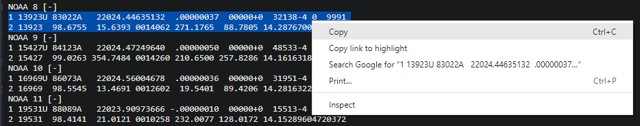
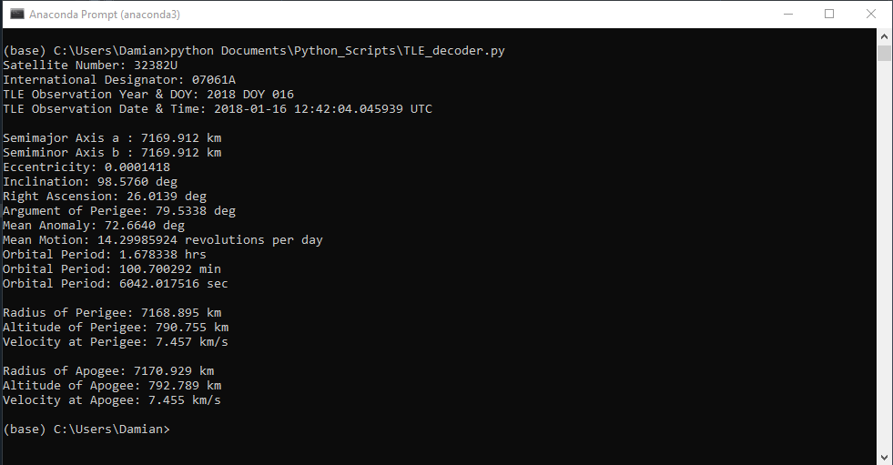

## What is the TLE Decoder?
The TLE decoder is a python script that takes in the values from a Two-Line Element Set (TLE) and outputs the relevant orbital parameters for a satelite. This also includes when the data for the TLE was taken.

## How to use the TLE Decoder
Use of the TLE decoder is fairly straight forward and only requires the script itself and a TLE. To use this script:
* Download the python script to your local computer.
* Copy a TLE to your clipboard, excluding the name of the satellite. The satellite name is usually the first of the three lines.

* Execute the script via command line. (No additional arguments are needed)
* The orbital parameters will then print out in the terminal window.

